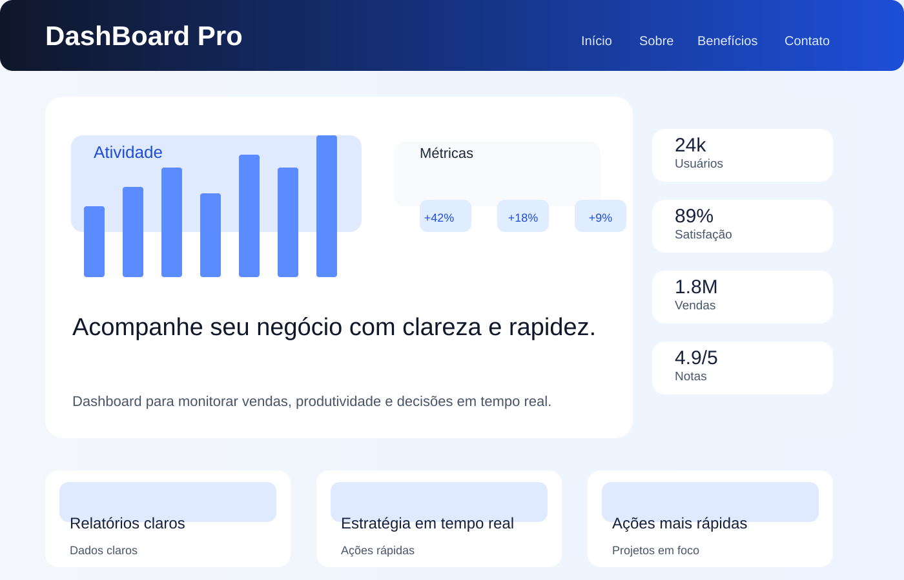

# Dashboard Simples

Projeto de home-page responsiva com tema de dashboard básico, desenvolvido com HTML, CSS e Bootstrap.

## Dados do aluno
- Nome: Liatt Torres
- Atividade: Evolução e responsividade com Bootstrap da home-page
- Tema: Dashboard simples e funcional

## Objetivo
A página foi estruturada com uma visualização mais limpa e didática, mantendo a responsividade do Bootstrap, mas com um estilo mais básico e acessível para o nível do projeto.

## Estrutura da home-page
- Cabeçalho com brand e navegação
- Seção principal com banner e texto introdutório
- Seção de benefícios com cards e imagens
- Rodapé com links de redes sociais

## Capturas

### Desktop

### Mobile

